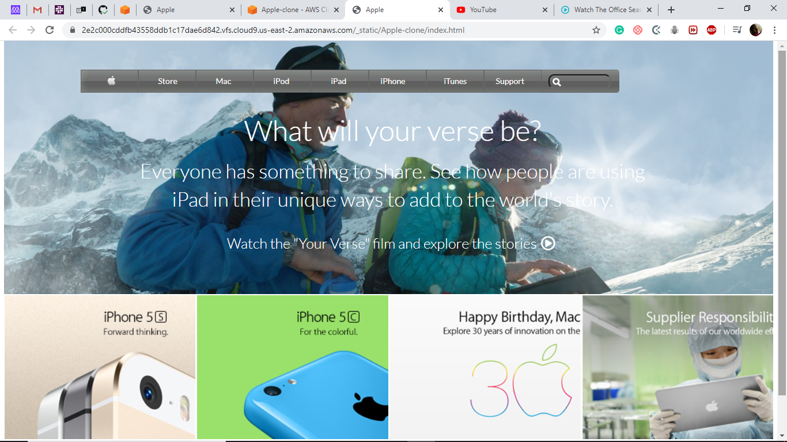

# Appl Clone Page
This is a clone of the Apple Page.

# Short description
This is a clone of the apple website (https://web.archive.org/web/20140301004610/http://www.apple.com/). I created it using flex, css grid and 
float css values. 
The project is a Microverse challenge to improve and test my skills building backgrounds with images and gradients.

## Built with
HTML and CSS

## Live Demo
[Click for the Form clone](https://raw.githack.com/blackpintz/Apple-clone/home-page/index.html)

## Authors
Rose Wanjohi

Github: @blackpintz
Twitter: @blackpintz
Linkedin: https://www.linkedin.com/in/rose-wanjohi-923726193/

## 🤝 Contributing

Contributions, issues and feature requests are welcome! Start by:
* Forking the project
* Cloning the project to your local machine
* `cd` into the project directory
* Run `git checkout -b your-branch-name`
* Make your contributions
* Push your branch up to your forked repository
* Open a Pull Request with a detailed description to the development branch of the original project for a review

## Pending and proposed features
* Working buttons and links
* Design improvments